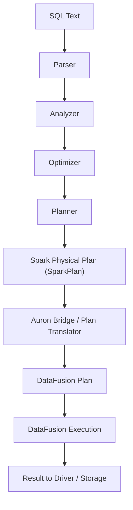
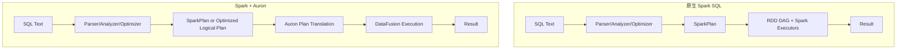
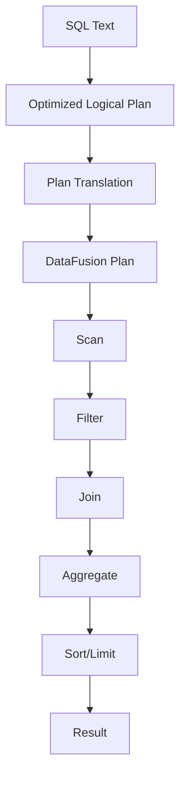

这份笔记假设：Spark 在执行 SQL 时接入了 Auron，引擎侧不再落到 Spark 原生的 RDD/DAG，而是把执行转换为 DataFusion 物理计划并运行。核心变化是：**逻辑规划仍在 Spark，但物理执行切换到 DataFusion**。

> 说明：本文强调流程结构与责任边界，不绑定某个具体集成实现细节。

## 概念分层（从 Spark 到 Auron）

### 1. 语义层（SQL 文本）
用户提交 SQL，语义仍由 Spark SQL 负责。

### 2. 逻辑层（Spark Logical Plan）
Parser/Analyzer/Optimizer 的产物仍是 Spark 的逻辑计划，这是语义与优化的核心。

### 3. 物理层（切换点）
传统 Spark 会生成 `SparkPlan` 并转换为 RDD DAG。接入 Auron 后，会在规划或执行阶段把 Spark 物理计划**改写/下推**为 DataFusion 计划（逻辑或物理），由 DataFusion 负责执行。

### 4. 执行层（DataFusion 引擎）
DataFusion 负责算子执行、任务并行与结果输出。Spark 负责调度容器/资源并管理会话与元数据。

## 端到端流程（高层）



## 与原生 Spark SQL 对比（执行层差异）



## 详细步骤（角色与职责）

### 1. Spark SQL 前半段（不变）
- **Parser**：SQL -> 未解析逻辑计划
- **Analyzer**：表/列/函数绑定
- **Optimizer**：规则/成本优化

### 2. 物理计划阶段（切换发生点）
- Spark 生成物理计划候选
- Auron 接入后，会在“生成/执行前”阶段把 Spark 物理计划或优化后的逻辑计划翻译成 DataFusion 计划

常见翻译方式（概念）：
- 逻辑计划翻译：Spark Optimized Logical Plan -> DataFusion Logical Plan
- 物理计划翻译：SparkPlan -> DataFusion Physical Plan

### 3. 执行阶段（DataFusion 负责）
- DataFusion 执行扫描、过滤、投影、聚合、Join
- 读写可能走 Arrow/Parquet/HDFS 连接层（取决于集成）
- 结果回传 Spark Driver 或写回存储

### 4. Spark 仍保留的职责
- 会话/元数据管理（Catalog、SQL 配置）
- 资源申请与生命周期管理（Driver/Executor 进程）
- 任务级监控与历史事件（视集成深度）

## 执行链路与依赖（简化）



## 和原生 Spark 执行的对比点

- **逻辑优化仍由 Spark 做**，保证 SQL 语义与优化规则一致
- **执行引擎切换到 DataFusion**，Spark 不再生成 RDD DAG
- **算子实现变了**：SparkPlan -> DataFusion Physical Plan
- **运行时特性变化**：Shuffle、内存管理、代码生成路径由 DataFusion 控制

## 一个 SQL 串起来（示意）

SQL：

```sql
SELECT u.city, COUNT(*) AS cnt
FROM user_events e
JOIN dim_users u ON e.user_id = u.user_id
WHERE e.event_type = 'purchase'
GROUP BY u.city
ORDER BY cnt DESC
LIMIT 10;
```

执行路径（简化）：

1. Spark 解析与优化，得到 Optimized Logical Plan
2. Auron 将 Optimized Plan 翻译为 DataFusion 计划
3. DataFusion 扫描 `user_events` 与 `dim_users`
4. 执行过滤、Join、聚合、排序、限制
5. 结果回传 Spark Driver 或写回存储

## 小结

- Spark 仍然负责 SQL 语义、优化与元数据
- Auron 负责物理执行与算子落地（DataFusion）
- RDD DAG 不再是执行核心，执行计划以 DataFusion 为准

如果你希望，我可以补充：
- 更细化的“计划翻译层”示例
- 与 AQE/AQE 关闭时的差异
- DataFusion 执行侧可能涉及的算子与 shuffle 处理方式
