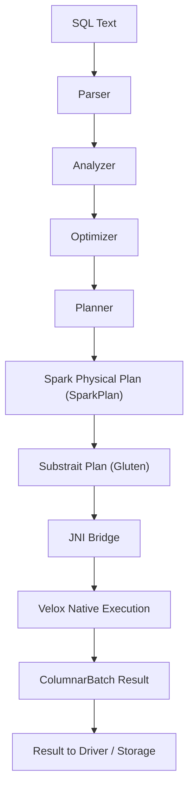

# Spark + Gluten + Velox：端到端执行流程（替代 RDD 物理执行）

以下内容以 Spark 3.x + Apache Gluten（Velox 后端）为背景。核心思想是：**Spark 仍生成物理计划，但执行阶段把 Spark 物理计划转换为 Substrait 计划并下推到 Velox 原生引擎执行**，结果以列式批次回传 Spark。

> 说明：你提到的 “volex” 这里按主流拼写 **Velox** 处理，如有不同实现名请告诉我。

## 概念分层（从 Spark 到 Velox）

### 1. 语义层（SQL 文本）
SQL 语义与解析仍由 Spark SQL 负责。

### 2. 逻辑层（Spark Logical Plan）
Parser/Analyzer/Optimizer 仍产出 Spark 的逻辑计划。

### 3. 物理层（切换点）
Spark 生成 `SparkPlan` 后，Gluten 将其转换为 **Substrait 计划**，通过 JNI 交给原生引擎执行。

### 4. 执行层（Velox 原生引擎）
Velox 是 C++ 的高性能执行引擎，Gluten 在原生侧构建算子链并执行，结果以列式批次返回给 Spark。

## 端到端流程（高层）



## 与原生 Spark SQL 对比（执行层差异）

```mermaid
flowchart TB
  subgraph Native["原生 Spark SQL"]
    N1[SQL Text] --> N2[Parser/Analyzer/Optimizer]
    N2 --> N3[SparkPlan]
    N3 --> N4[RDD DAG + Spark Executors]
    N4 --> N5[Result]
  end

  subgraph Gluten["Spark + Gluten + Velox"]
    G1[SQL Text] --> G2[Parser/Analyzer/Optimizer]
    G2 --> G3[SparkPlan]
    G3 --> G4[Substrait Plan (Gluten)]
    G4 --> G5[JNI -> Velox Execution]
    G5 --> G6[ColumnarBatch Result]
    G6 --> G7[Result]
  end
```

## 详细步骤与责任边界

### 1. Spark 侧（不变的部分）
- 解析与优化：Parser / Analyzer / Optimizer
- 生成物理计划：Planner -> `SparkPlan`

### 2. Gluten 侧（核心变更）
- 将 `SparkPlan` 转换为 Substrait 计划
- 通过 JNI 传递给原生侧执行
- 使用 Spark 的列式接口回传结果（`ColumnarBatch`）

### 3. Velox 侧（执行引擎）
- 构建原生算子链（过滤、投影、聚合、Join 等）
- 使用列式内存布局执行
- 产出列式结果批次

## 兼容与回退（必须知道）

Gluten/Velox 并不能覆盖 Spark 的所有算子与语义。当出现不支持的算子、函数或配置时，会回退到原生 Spark 执行。典型回退场景包括：
- ANSI 模式开启
- 函数/算子覆盖不足
- 某些特定行为与 Spark 语义不兼容

这些限制与回退在官方文档中有明确说明。

## 和原生 Spark 执行的核心差异

- **物理执行层切换**：SparkPlan 不直接生成 RDD DAG，而是转 Substrait + Velox
- **算子实现切换**：Spark 的 JVM 算子 -> Velox 原生算子
- **数据传递切换**：以列式批次（ColumnarBatch）为主要载体
- **兼容性**：部分算子/函数会回退到原生 Spark

## 一个 SQL 串起来（示意）

```sql
SELECT u.city, COUNT(*) AS cnt
FROM user_events e
JOIN dim_users u ON e.user_id = u.user_id
WHERE e.event_type = 'purchase'
GROUP BY u.city
ORDER BY cnt DESC
LIMIT 10;
```

执行路径（简化）：
1. Spark 解析与优化 -> SparkPlan
2. Gluten 转换 SparkPlan -> Substrait
3. Velox 执行过滤、Join、聚合、排序
4. 结果以 ColumnarBatch 回传 Spark
5. Spark Driver 输出或写回存储

## 小结

- Spark 负责 SQL 语义、优化与会话/元数据
- Gluten 负责计划翻译与 JNI 桥接
- Velox 负责原生执行与列式计算
- 不支持的算子会回退到原生 Spark 执行

如果你需要更细化的“Substrait 转换层”或“回退判定”示意图，我可以继续补充。
