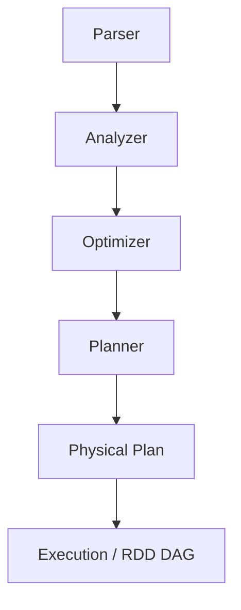
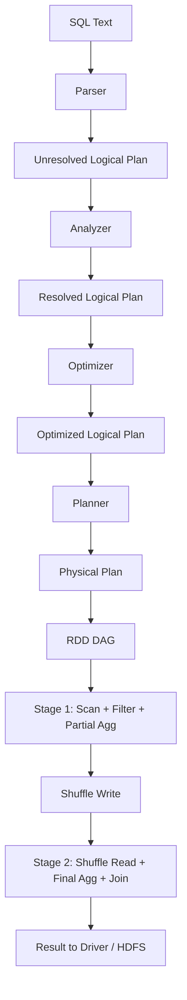
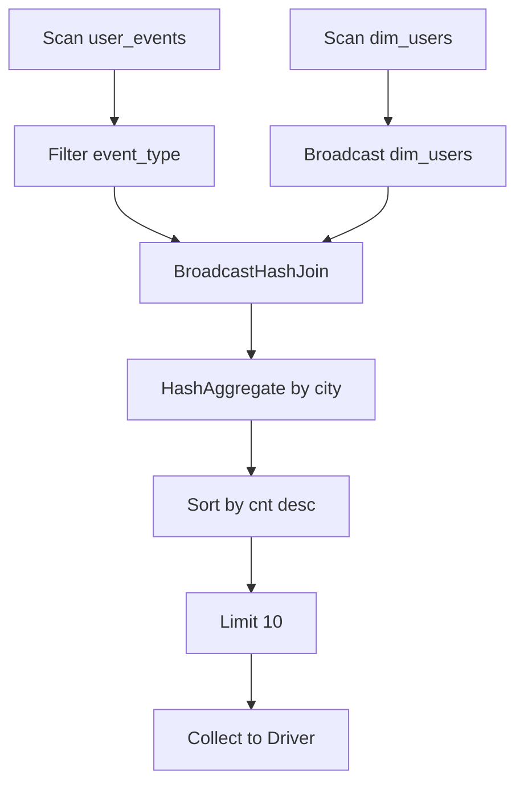

# Spark SQL：从一条 SQL 到最终结果的端到端路径

下面这份笔记围绕一个核心问题：一条 SQL 是如何从文本变成可执行任务，最终在 Executor 上读取 HDFS 数据并返回结果的？

我会先按“层次”讲概念，再按“流程”讲大步骤，最后用一条 SQL 串起来。过程中用简化的 Mermaid 图辅助理解。

## 概念分层（从抽象到执行）

### 1. 语义层（SQL 语法与业务意图）
你写的是 SQL 文本，它表达的是“我要什么结果”。这层不关心数据怎么读、怎么执行，只关心语义正确性。

### 2. 逻辑层（Logical Plan）
Spark 会把 SQL 变成逻辑计划，逻辑计划是“做什么”的结构化表达：投影、过滤、聚合、Join 等。

逻辑计划分两种：
- **未解析逻辑计划（Unresolved Logical Plan）**：只有语法结构，没有具体表/列/函数绑定
- **解析后逻辑计划（Resolved Logical Plan）**：已绑定 Catalog 中的表、列、数据类型、函数

### 3. 优化逻辑层（Optimized Logical Plan）
通过一系列规则，把逻辑计划“变小、变快、变合理”。例如：
- 谓词下推（Filter Pushdown）
- 列裁剪（Column Pruning）
- 常量折叠（Constant Folding）
- Join 重排 / Join 类型转换

### 4. 物理层（Physical Plan）
逻辑计划会变成多个可执行的物理计划候选，Spark 根据成本模型选择一个最佳方案，并输出物理算子树。

典型物理算子包括：
- `FileScan` / `DataSourceScan`（读 HDFS / Parquet / ORC 等）
- `Filter` / `Project` / `Aggregate`
- `BroadcastHashJoin` / `SortMergeJoin` / `ShuffledHashJoin`
- `Exchange`（Shuffle）
- `Sort` / `HashAggregate` / `SortAggregate`
- `Limit` / `CollectLimit`

### 5. 执行层（RDD + Task）
物理计划会转换成一串 RDD 转换与动作，形成 DAG，最终被切分为 Stage 与 Task，在 Executor 上执行。

## 四大步骤（Catalyst 核心流程）



### Parser
输入 SQL 文本，输出未解析逻辑计划。

### Analyzer
结合 Catalog 与函数注册表，完成表/列/函数绑定，并做类型推断与语义校验。

### Optimizer
基于规则（Rule-based）或成本（CBO），对逻辑计划做优化，输出优化后的逻辑计划。

### Planner
把逻辑计划转换为多个物理计划候选，选择最优方案。

## 关键类映射（Spark 3.x 视角）

下面列出典型类名，帮助你把“概念步骤”对照到代码实现。不同版本、小版本和数据源（V1/V2）会有少量差异，但主线一致。

### Parser 相关
- `SparkSqlParser`：SQL 文本解析入口（继承自 `AbstractSqlParser`）
- `AstBuilder`：把解析树转换为 Catalyst 逻辑计划

### Analyzer 相关
- `Analyzer`：核心解析器（继承 `RuleExecutor[LogicalPlan]`）
- `ResolveRelations` / `ResolveReferences`：表与列解析
- `ResolveFunctions`：函数解析
- `ResolveAliases`：别名解析
- `TypeCoercion`：类型推断与隐式转换

### Optimizer 相关
- `Optimizer`：逻辑优化入口（继承 `RuleExecutor[LogicalPlan]`）
- 常见规则：`PushDownPredicate`、`ColumnPruning`、`ConstantFolding`、`ReorderJoin`

### Planner 相关
- `SparkPlanner`：物理计划生成入口（继承 `QueryPlanner[SparkPlan]`）
- 常见策略（Strategy）：`JoinSelection`、`Aggregation`、`BasicOperators`、`Window`、`DataSourceStrategy`

### 物理算子（SparkPlan）常见类
- 扫描：`FileSourceScanExec`（V1）、`BatchScanExec` / `DataSourceV2ScanExec`（V2）
- 过滤/投影：`FilterExec`、`ProjectExec`
- 聚合：`HashAggregateExec`、`SortAggregateExec`
- Join：`BroadcastHashJoinExec`、`SortMergeJoinExec`、`ShuffledHashJoinExec`
- Shuffle 边界：`ShuffleExchangeExec`
- 广播：`BroadcastExchangeExec`
- 排序/限制：`SortExec`、`LimitExec`、`CollectLimitExec`、`TakeOrderedAndProjectExec`
- 代码生成：`WholeStageCodegenExec`
- 自适应执行：`AdaptiveSparkPlanExec`

### 读 HDFS 相关（常见路径）
- 关系封装：`HadoopFsRelation`
- RDD 读取：`FileScanRDD` / `FilePartition`

## 从 SQL 到 Executor：执行路径与依赖关系

下面把执行路径拆成两个层级：
- **Driver 上完成的工作**：解析、优化、生成物理计划、调度任务
- **Executor 上完成的工作**：读取数据、执行算子、输出结果

### Driver 负责的关键动作
- 解析 SQL + 生成逻辑计划
- 解析绑定（Analyzer）
- 优化逻辑计划
- 生成物理计划（SparkPlan）
- 生成 RDD DAG
- 切分 Stage（按 Shuffle 边界）
- Task 调度与资源分配

### Executor 负责的关键动作
- 读取 HDFS（FileScan）
- 执行 Filter / Project / Aggregate / Join 等物理算子
- Shuffle 读写（写出中间结果，拉取其他分区）
- 最终结果回传 Driver 或写出到存储

### 关键依赖关系（简化）



这里面两个关键的依赖点：
- `Exchange` 是 Shuffle 边界，会切分 Stage
- Join / Aggregate 往往触发 Shuffle，导致跨分区依赖

## 物理算子在哪执行？哪些不在 Executor 执行？

### 在 Executor 上执行的算子（典型）
- `FileScan` / `BatchScan`：读取 HDFS 文件块（Parquet/ORC/CSV）
- `Filter` / `Project`
- `HashAggregate` / `SortAggregate`
- `BroadcastHashJoin` / `SortMergeJoin`
- `Sort` / `Exchange`（Shuffle 的读写由 Executor 完成）

### 不在 Executor 上执行（或主要在 Driver）
- SQL 解析 / 解析校验（Parser / Analyzer）
- 逻辑优化 / 物理计划选择（Optimizer / Planner）
- DAG 划分、Stage 切分、Task 生成与调度
- Driver 端 Collect / Show 结果汇总

> 例外提示：`Collect` 会触发 Executor 执行任务，但“结果聚合与输出”发生在 Driver。

## 一个 SQL 例子串起来

假设有两张表：
- `user_events`（Parquet，HDFS）
- `dim_users`（小维表，可能被广播）

SQL：

```sql
SELECT u.city, COUNT(*) AS cnt
FROM user_events e
JOIN dim_users u ON e.user_id = u.user_id
WHERE e.event_type = 'purchase'
GROUP BY u.city
ORDER BY cnt DESC
LIMIT 10
```

### 1. Parser
生成未解析逻辑计划：
- `Project(city, count(*))`
- `Join(user_events, dim_users, user_id)`
- `Filter(event_type = 'purchase')`
- `Aggregate(group by city)`
- `Sort` + `Limit`

### 2. Analyzer
- 绑定 `user_events` 与 `dim_users`
- 解析列名与数据类型
- 校验 `user_id` / `event_type` / `city` 是否存在
- 生成解析后逻辑计划

### 3. Optimizer（常见优化）
- 把 `Filter(event_type='purchase')` 下推到 `user_events` 扫描
- 列裁剪：`user_events` 只读 `user_id` + `event_type`，`dim_users` 只读 `user_id` + `city`
- 如果 `dim_users` 很小，倾向广播 Join

### 4. Planner（生成物理计划）
一种常见物理计划是：
- `FileScan Parquet user_events`
- `Filter`（event_type）
- `FileScan Parquet dim_users`
- `BroadcastHashJoin`（dim_users 作为广播侧）
- `HashAggregate`（按 city 聚合）
- `Sort` + `Limit`

### 5. 执行细节（Stage 切分简化）



- `Scan`、`Filter`、`Join`、`Aggregate`、`Sort` 都在 Executor 执行
- `Broadcast` 由 Driver 发起，但实际广播数据分发与 Join 执行在 Executor
- 如果 `dim_users` 不小，Join 会变成 `SortMergeJoin`，并引入 `Exchange`（Shuffle）

### 6. 最终结果返回
- 如果是 `SELECT ... LIMIT`，结果会回传 Driver 并显示
- 如果是 `INSERT INTO` 或 `SAVE AS`，结果会由 Executor 写回 HDFS

## 小结
- 前两步（Parser/Analyzer）解决“能不能执行”
- 后两步（Optimizer/Planner）解决“怎么更快”
- Shuffle 是最重要的执行边界
- Executor 执行绝大多数物理算子，Driver 负责计划与调度

如果你希望我补充：
- 更真实的 `explain` 输出示例
- 结合 AQE（Adaptive Query Execution）
- 更复杂的 Join/Window/CTE
告诉我即可。

## spark-sql 交互验证脚本（建表 + 查询）

下面是一套可以直接在 `spark-sql` 交互终端执行的完整 SQL，和上面的示例一致，包含建表、插入与查询。

```sql
-- 可选：降低 shuffle 分区，便于本地查看
SET spark.sql.shuffle.partitions=4;

-- 清理旧表
DROP TABLE IF EXISTS user_events;
DROP TABLE IF EXISTS dim_users;

-- 建表：事实表
CREATE TABLE user_events (
  user_id    BIGINT,
  event_type STRING,
  ts         STRING
)
USING parquet;

-- 建表：维表
CREATE TABLE dim_users (
  user_id BIGINT,
  city    STRING
)
USING parquet;

-- 插入事件数据
INSERT INTO user_events VALUES
  (1, 'purchase', '2026-03-01 10:01:00'),
  (1, 'click',    '2026-03-01 10:02:00'),
  (2, 'purchase', '2026-03-01 11:01:00'),
  (3, 'purchase', '2026-03-01 12:01:00'),
  (4, 'click',    '2026-03-01 12:05:00'),
  (5, 'purchase', '2026-03-01 12:06:00');

-- 插入维表数据（故意少一些，让 join 有不匹配）
INSERT INTO dim_users VALUES
  (1, 'Shanghai'),
  (2, 'Beijing'),
  (3, 'Shanghai');

-- 查询：与文章一致
SELECT u.city, COUNT(*) AS cnt
FROM user_events e
JOIN dim_users u ON e.user_id = u.user_id
WHERE e.event_type = 'purchase'
GROUP BY u.city
ORDER BY cnt DESC
LIMIT 10;

-- 如需查看执行计划
EXPLAIN EXTENDED
SELECT u.city, COUNT(*) AS cnt
FROM user_events e
JOIN dim_users u ON e.user_id = u.user_id
WHERE e.event_type = 'purchase'
GROUP BY u.city
ORDER BY cnt DESC
LIMIT 10;
```
