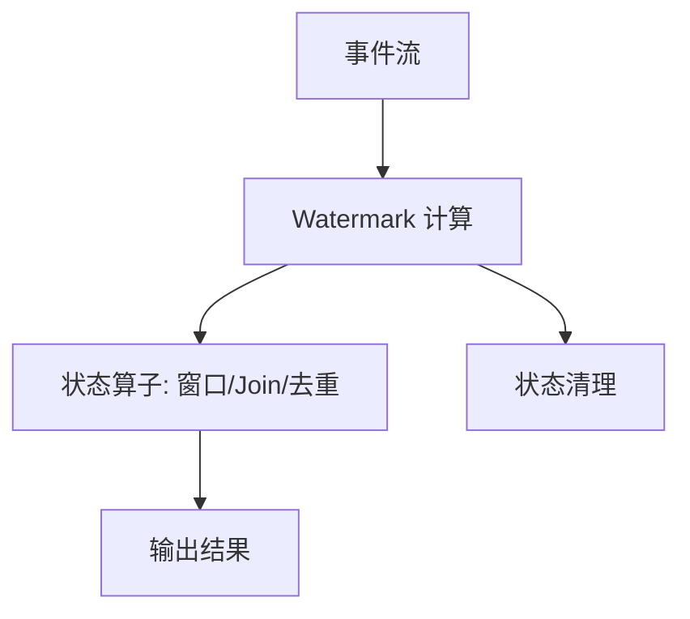

# Watermark 详解：定义、作用与在流计算中的应用

Watermark（水位线）是流计算里的核心概念，用来**描述事件时间（Event Time）上“已经基本到齐”的边界**。它告诉系统：早于某个时间点的事件大概率不会再到达，从而允许**输出结果**和**清理状态**。

> 直观理解：Watermark 是“允许迟到”的边界线，系统会等到水位线推进到某个时间再结算。

## 为什么需要 Watermark

在流式系统中，数据常常**乱序**或**延迟到达**：
- 事件发生在 10:00，但 10:05 才到达
- 同一批事件在不同节点上到达时间不同

如果不引入 Watermark：
- 系统必须无限等待迟到数据
- 状态会无限增长
- 窗口无法稳定输出

Watermark 提供了一个**可控的迟到容忍**机制，让系统在“准确性”和“可用性/资源”之间做权衡。

## Watermark 的核心作用

1. **窗口结果的最终输出条件**
   - 例如：允许事件迟到 10 分钟，当 watermark >= 窗口结束时间 + 10 分钟，窗口结果才会最终输出。

2. **状态清理（State Cleanup）**
   - 对于聚合、去重、Join 等需要维护状态的算子，watermark 用来触发旧状态清理，避免状态无限增长。

3. **迟到数据的处理策略**
   - watermark 之后到来的事件会被丢弃或计入“迟到数据”指标（具体行为取决于系统配置）。

## Watermark 的基本定义

一般定义：

```
watermark = max_event_time_seen - allowed_lateness
```

- `max_event_time_seen`：系统已观察到的最大事件时间
- `allowed_lateness`：允许迟到的时间窗口

Watermark 不是固定时间点，而是**随数据流推进的动态边界**。

## Event Time vs Processing Time

- **Event Time**：事件真正发生的时间（业务时间）
- **Processing Time**：事件被系统处理的时间（机器时间）

Watermark 基于 **Event Time**，不是 Processing Time。

## 在 Spark Structured Streaming 中的 Watermark

### 1. 设置 Watermark

Spark 中通常写法：

```sql
WITH watermark AS (
  SELECT *, window(event_time, '10 minutes') AS w
  FROM events
)
```

或 DataFrame API：

```scala
val df = events
  .withWatermark("event_time", "10 minutes")
  .groupBy(window($"event_time", "10 minutes"), $"user_id")
  .count()
```

### 2. 行为要点

- Watermark 只对 **事件时间字段**生效
- 只有在需要状态的算子上（window/aggregation/join/dedup）才有意义
- Watermark 会影响输出模式（append/update/complete）

### 3. 状态清理示意

```
窗口结束时间 = 10:00
允许迟到 = 10 min
watermark >= 10:10  -> 该窗口可最终输出并清理
```

## Watermark 与常见算子

- **Window 聚合**：决定何时“最终输出”窗口
- **Stream-Stream Join**：限制 join 状态保留时间
- **去重（dropDuplicates）**：限制去重状态保留时间

## 常见误区

- Watermark 不是“立即丢弃迟到数据”
- Watermark 是动态推进的，不是固定点
- Watermark 只对基于事件时间的计算有效

## 一张流程图（简化）



## 小结

- Watermark 是事件时间上的“允许迟到”边界
- 解决乱序与延迟到达的问题
- 提供结果可输出与状态可清理的条件
- 是流式窗口、去重、Join 等的关键机制

如果你希望补充 Spark 的具体输出模式示例（append/update/complete）或 Streaming Join 的 Watermark 细节，我可以继续完善。
